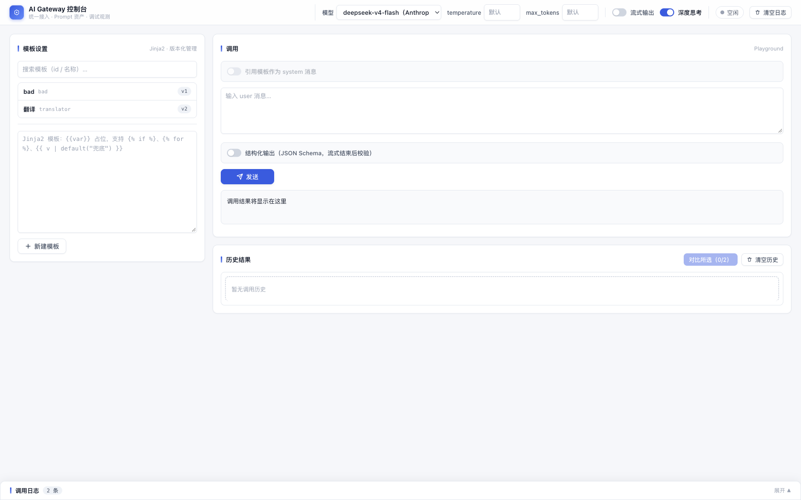
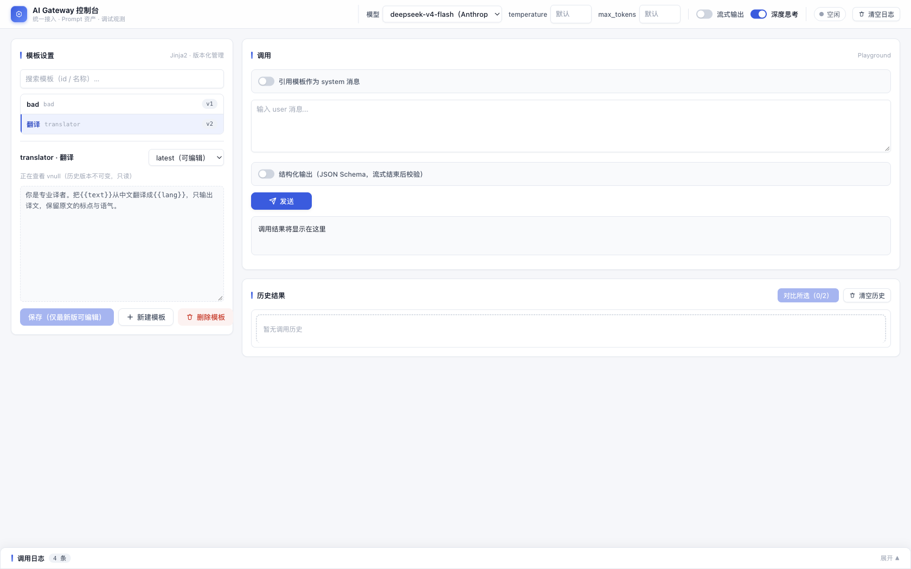
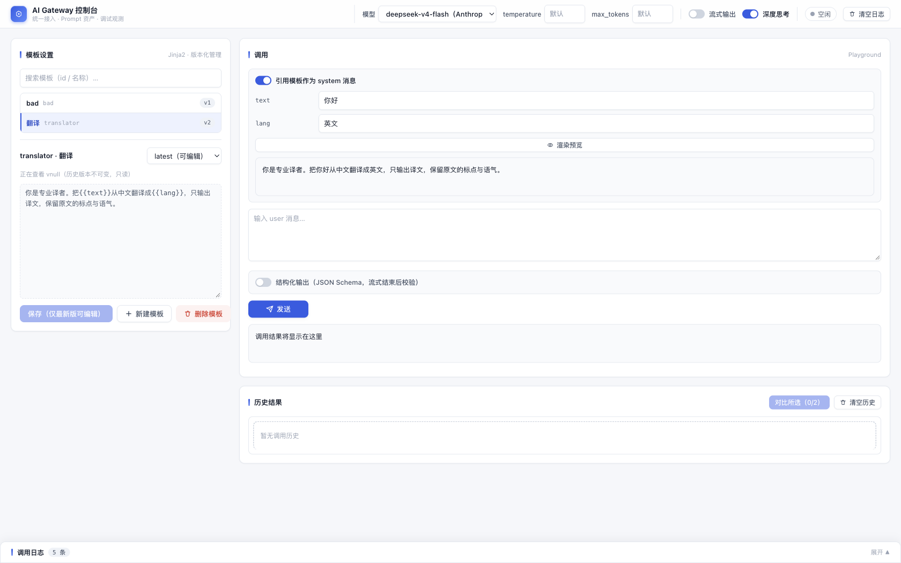
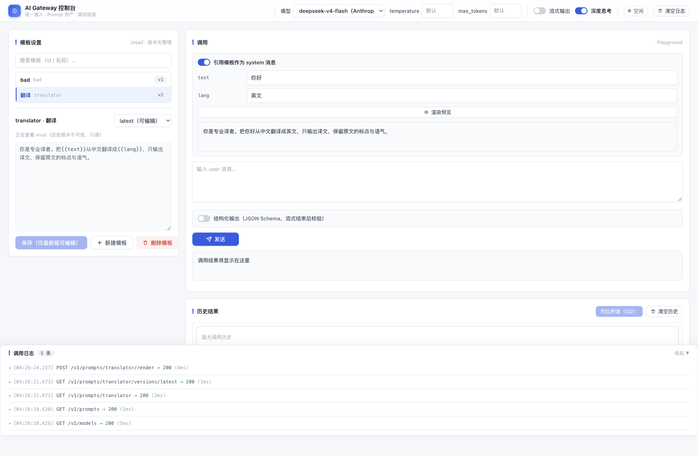
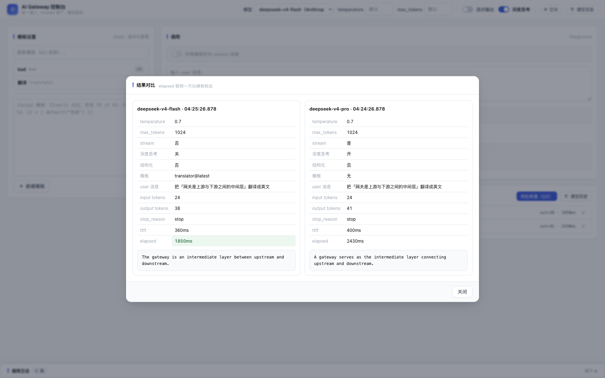

# AI Gateway 控制台 UI/UX 重设计说明

> 交付物：本设计说明 + [static/index.html](../../../static/index.html) + [static/style.css](../../../static/style.css)（已落地实现）+ 5 张关键页面视觉设计稿（本目录 `ui-redesign/*.png`）。
> 约束达成：app.js 零改动，全部功能、ID 绑定与交互逻辑保持不变；重设计后 135 个测试全过，浏览器实测无 JS 报错。

---

## 1. 设计目标与原则

**定位**：开发者自用的 LLM Gateway 调试控制台——Playground、Prompt 资产管理、调用观测三类任务高频交替。

**气质参照**：Linear / Vercel / Stripe Dashboard 式精密开发工具——冷静、克制、层级清晰。

**五条设计原则**：

1. **数据即界面**：技术数据（模型名、token 数、耗时、模板 id）一律等宽字体 + `tabular-nums`，正文用无衬线，两者永不混排。
2. **层次靠明度不靠色块**：界面骨架用 hairline 边框 + 极浅阴影 + 三档表面明度（`--bg` → `--surface` → `--surface-2`）表达；彩色只留给语义（强调蓝、成功绿、警示橙、危险红）。
3. **一屏一主操作**：每个面板只有一个视觉最重的主按钮（保存 / 发送），其余全部降级为 ghost / sm 形态。
4. **状态永远可见**：流式状态胶囊、校验结论、错误信息条、禁用态按钮——任何异步过程都有即时、带色的反馈。
5. **克制的动效**：统一 140ms、只作用于 hover/focus/状态切换，`prefers-reduced-motion` 下全部关闭。

---

## 2. 设计系统（Design Tokens）

定义于 `style.css` 的 `:root`，全部组件只引用 token，不写裸值（hover 加深等派生色除外）。

### 2.1 色彩

| 类别 | Token | 值 | 用途 |
|---|---|---|---|
| 表面 | `--bg` | `#f5f7fa` | 应用底色（冷灰蓝调） |
| | `--surface` | `#ffffff` | 卡片 / 控件 |
| | `--surface-2` | `#f8fafc` | 嵌套区、代码底、弹窗 footer |
| | `--surface-3` | `#eef2f7` | hover 填充、徽章底 |
| 边框 | `--border` / `--border-strong` | `#e3e8ef` / `#cdd5e0` | hairline / hover 加深 |
| 文字 | `--text-1/2/3` | `#101828` / `#475467` / `#98a2b3` | 主文 / 次级 / 辅助 |
| 强调 | `--accent` / `--accent-strong` | `#2e5ce6` / `#1f47c7` | 主按钮、焦点、选中、链接态 |
| | `--accent-soft` / `--accent-border` | `#edf2ff` / `#c3d2ff` | 选中行背景 / 状态胶囊描边 |
| 成功 | `--ok` / `--ok-bright` | `#067647` / `#12b76a` | 文本 / 状态点 |
| 警示 | `--warn` / `--warn-bright` | `#b54708` / `#f79009` | 文本 / 状态点 |
| 危险 | `--danger` | `#d92d20` | 错误文本、删除、停止 |

语义色统一采用「深色文字 + 浅色底 + 中间色描边」三件套（`-soft` / `-border`），保证浅色底上的对比度达标。

### 2.2 字体与字号

- 无衬线：`-apple-system, "SF Pro Text", "PingFang SC", …`；**正文基准 13px / 1.6**（开发工具的合理密度）。
- 等宽：`ui-monospace, "SF Mono", Menlo, …`；用于模板正文、JSON、日志、id、所有统计数字，11–12.5px。
- 层级：h1 14px/650（品牌）→ h2 13px/600（面板标题，左侧 3px 蓝色刻度线统一标记）→ 正文 13px → 辅助 11.5–12px。

### 2.3 间距 / 圆角 / 阴影 / 动效

- 间距：4px 网格（4/8/12/16/20）；页面留白 20px，卡片内边距 16px，面板间距 16px。
- 圆角：控件 6px → 嵌套面板 8px → 卡片 10px → 弹窗 14px → 胶囊 999px，随元素尺寸递进。
- 阴影三档：`-xs`（卡片微浮）、`-sm`（主按钮/输入框）、`-md`（弹窗悬浮）。
- 动效：`--t-fast: 140ms` + `cubic-bezier(0.33,0,0.2,1)`。

---

## 3. 布局架构与信息层级

```
┌────────────────────────── 顶栏（sticky + 毛玻璃） ──────────────────────────┐
│ 品牌（徽标+标题+定位语） │ 模型/temperature/max_tokens │ 输出开关组 │ 状态胶囊+清空日志 │
├──────────────┬────────────────────────────────────────────────────────────┤
│ 模板设置（左栏 30vw）│  调用（Playground）                                  │
│ 搜索 / 列表   │  ┌ 引用模板子面板（变量表单+渲染预览）┐                      │
│ 编辑器        │  user 消息 → 结构化输出子面板 → 发送                          │
│              │  结果画布：reasoning 折叠 → 正文 → 校验条 → 元信息              │
│              ├────────────────────────────────────────────────────────────┤
│              │  历史结果（勾选对比 / 删除）                                  │
├──────────────┴────────────────────────────────────────────────────────────┤
│ 调用日志抽屉（sticky bottom，可折叠，带计数徽章）                              │
└──────────────────────────────────────────────────────────────────────────┘
```

关键调整：

1. **顶栏分区化**：品牌区（新增渐变徽标 + 定位副标「统一接入 · Prompt 资产 · 调试观测」）与控制区用竖分隔线分为三组，参数、开关、状态一目了然；sticky + backdrop-filter 保证滚动时控制项常驻。
2. **左栏定宽**：`clamp(330px, 30vw, 410px)`，模板编辑宽度稳定，右栏 Playground 拿到最大空间。
3. **子面板（inset panel）**：「引用模板」与「结构化输出」归入 `--surface-2` 圆角子卡片，与主输入区形成从属关系——「开关 + 折叠内容」成为全站一致的交互模式。
4. **日志抽屉 sticky bottom**：折叠时只占一条标题栏且始终可见，展开上限 34vh，不挤占主工作区。
5. **结果区（响应画布）**：reasoning 折叠面板、正文、校验条、元信息自上而下成组，元信息用虚线分隔 + 等宽数字，扫读成本低。

---

## 4. 组件设计规范

| 组件 | 规范要点 |
|---|---|
| **按钮** | 主按钮：accent 实底 32px；ghost：白底描边 + xs 阴影；danger：浅红底（非大红实底，降攻击性）hover 加描边；sm：26px 用于面板头。统一 focus-visible 蓝色 3px 焦点环。关键操作配 14px 线性图标（发送/停止/新建/删除/预览/清空） |
| **开关** | 纯 CSS 胶囊开关（30×17，圆点位移 13px），`checked` 时轨道变 accent、文字升级为 `--text-1`；禁用 45% 透明 |
| **状态胶囊** | `:has()` 驱动整体变色：空闲灰 / 请求中橙 / 流式绿（脉冲）/ 完成蓝 / 出错红，胶囊底色与描边同步染色 |
| **输入框** | 白底 hairline + xs 阴影；hover 描边加深，focus 蓝描边 + 18% 焦点环；数字输入等宽 + `tabular-nums` |
| **模板列表** | 名称（600）+ id（mono 灰，ellipsis）+ 版本徽章（mono 胶囊）；hover 浅灰底，active 蓝底 + 左侧 2px 蓝条（inset box-shadow，不抖动布局） |
| **历史列表** | 时间(mono) / 模型(600) / 模板引用(mono ellipsis) / 统计(右对齐 mono)，失败行红色；hover 浅灰；删除按钮 ghost 化 hover 变红 |
| **日志** | 单行摘要（mono 11.5px，状态码绿/红着色）+ ▸ 旋转展开 JSON 详情（surface-2 圆角框） |
| **空状态** | 虚线框 + 居中灰字，与列表容器留 8px 呼吸 |
| **信息条** | `.msg` / 校验条统一「深字 + 浅底 + 描边」三件套，成功绿 / 失败红 |
| **弹窗** | 去内边距改三段式（头部标题区 / 滚动正文 / footer），backdrop 加 2px 模糊；对比表 `elapsed` 较快方绿色高亮 + 浅绿底 |

---

## 5. 交互细节优化

1. **焦点可见性**：全站统一 `:focus-visible` 蓝色焦点环（含自定义开关用 `::before` 承接）。
2. **按钮按压反馈**：`active` 态 0.5px 下沉 + 色彩加深，触觉感明确。
3. **状态即时性**：发送后立即进入「请求中…」橙态 → 首包转「流式接收中…」绿态脉冲 → 完成蓝 / 出错红；中途取消保留已收文本。
4. **错误表达**：校验失败保留流式原文 + 逐条错误明细（field/type/message），不吞信息。
5. **可扫描性**：所有耗时/token 数字 `tabular-nums`，列表右对齐统计列，对比表逐行对齐。
6. **无障碍**：语义色对比度达 WCAG AA（正文 ≥ 4.5:1）；`prefers-reduced-motion` 关闭脉冲与过渡；开关保持原生 checkbox 键盘语义。
7. **响应式**：1080px 以下单列堆叠，720px 以下顶栏换行、紧凑间距。

---

## 6. 视觉设计稿

| 图 | 状态 |
|---|---|
|  | 01-overview：默认全景（顶栏分区 / 左栏模板 / Playground / 历史 / 日志条） |
|  | 02-template-edit：编辑态（版本下拉 / 只读历史 hint / 发布按钮） |
|  | 03-prompt-ref：引用子面板（变量表单 + 渲染预览） |
|  | 04-logs-open：日志抽屉展开态 |
|  | 05-compare-dialog：结果对比弹窗（elapsed 高亮） |

---

## 7. 实施与验证记录

- `index.html`：仅增量化结构调整（顶栏分组、面板头、子面板类名、内联 SVG 图标、SVG favicon、弹窗三段式），**全部 ID 与 JS 绑定点原样保留**；`app.js` 零改动。
- `style.css`：完全重写（~870 行），按 14 个分区组织，全部组件引用 token。
- 回归：`uv run python -m pytest tests/ -q` → **135 passed**；浏览器实测（CDP）Console 无报错、无元素溢出、hover/展开/对比弹窗交互正常。

## 8. 后续建议（未实施，按性价比排序）

1. `⌘/Ctrl + Enter` 快捷发送（需改 app.js，一行监听）。
2. 深色主题：token 体系已就绪，新增一组 `@media (prefers-color-scheme: dark)` 覆盖即可。
3. 日志支持按状态码 / 路径过滤（前端本地过滤即可）。
4. 结果区 Markdown 渲染开关（当前纯文本最稳，可选增强）。
